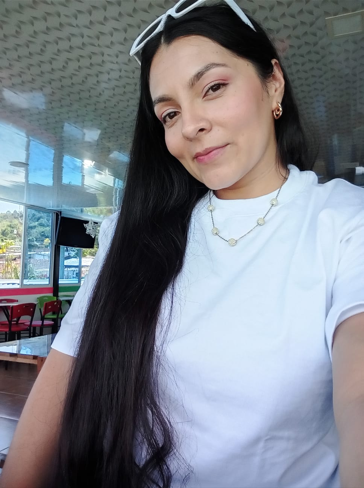

# Lesly - Equipo JuMa-Pixel

**Nombre:** Lesly Marllely Carmona Maya
**Rol:** Programadora Principal y Artista Técnica
**Ubicación:** Quinchía, Risaralda, Colombia

### Perfil 
Soy Lesly Carmona estudiante de programación de la UNAD, me gusta profundizar en el arte digital y los videojuegos. Soy creativa, responsable y me gusta el aprendizaje constante.

### Mi Plato Favorito

# Equipo: JuMa-Pixel

Somos el equipo de desarrollo para el curso de Programación para Videojuegos.

## Integrante: Laura Juliana Rodriguez Suarez 

* **Rol:** Líder de Proyecto y Diseñadora.
* **Ubicación:** Bogotá, Colombia

### Mi foto personal 

### Perfil
Soy Laura Juliana Rodriguez Suarez, estudiante de septimo semestre de Ingeniería Multimedia en la UNAD. Me apasiona el diseño de videojuegos, la creación de experiencias interactivas y el desarrollo de proyectos con un impacto social.

### Mi plato favorito 

